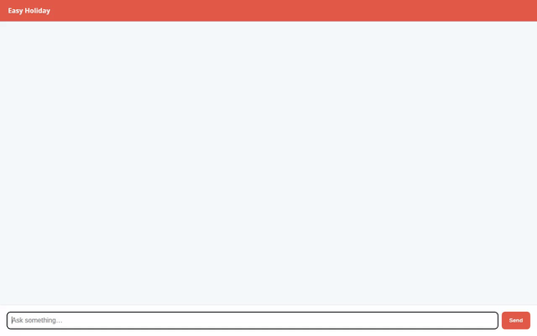

# Easy Holiday 🌴✈️

An AI-powered travel planning agent for India built with Vertex AI Reasoning Engine (ADK 1.1.0) and A2UI.



## Overview

**Easy Holiday** is a Pune-based India travel planner that crafts personalized holiday itineraries. It remembers traveler preferences via Vertex AI Memory Bank, queries curated Firestore collections for Indian destinations and national public holidays, retrieves live weather forecasts and exchange rates, generates custom travel posters, and renders rich interactive card UI components using A2UI.

## Key Features

- **Personalized Travel Preferences (Memory Bank)**: Integrated with Vertex AI Memory Bank to retain user-specific preferences:
  - **Home City**: Pune, India (`lat: 18.5204`, `lon: 73.8567`)
  - **Home Currency**: `INR` (`₹`)
  - **Budget Level**: Moderate
  - **Diet**: Vegetarian
  - **Travel Pace**: Relaxed
  - **Interests**: Nature, Culture, Beaches, Local Food
- **Firestore Collections**:
  - `destinations`: Indian travel spots (Palolem, Panaji, Lonavala, Mahabaleshwar, Hampi, Rishikesh) with average daily budgets, best seasons, and highlights.
  - `public_holidays`: India's official 2026 national public holidays.
- **Live Weather & Exchange Rates**:
  - **Open-Meteo API**: Live geocoding and daily weather forecasts.
  - **Frankfurter API**: Live `INR` currency exchange rates.
- **AI Travel Poster Generation**: Generates custom travel posters using `gemini-3.1-flash-lite-image` in the global region, saved to `gs://easy-holiday-qwiklabs-gcp-01-1b134bc81ede` with public URLs and Playground artifact compatibility.
- **Code Execution Sandbox**: Secure code execution powered by `AgentEngineSandboxCodeExecutor`.
- **A2UI Interactive Cards**: Generates structured A2UI UI card components (`a2ui-agent-sdk` v0.8 Basic Catalog).
- **FastAPI Proxy & Web UI**: Minimal proxy server and plain HTML/JS chat frontend communicating over the A2A protocol.

## Project Structure

```
easy_holiday/
├── app/
│   ├── agent.py               # Root ADK agent, tools, Memory Bank, sandbox & callback
│   ├── a2ui_utils.py          # A2UI callback transformer
│   └── app_utils/             # ADK application utilities
├── frontend/
│   ├── main.py                # FastAPI proxy server (A2A client)
│   ├── requirements.txt       # Frontend proxy dependencies
│   └── static/index.html      # Rebranded A2UI chat interface
├── seed_firestore.py          # Firestore database seeding script
├── agents-cli-manifest.yaml   # Agent Engine configuration manifest
├── pyproject.toml             # Python project dependencies
└── demo.gif                   # Recorded application demo
```

## Running Locally

### Prerequisites

- Python 3.10+
- `uv` package manager
- Google Cloud SDK (`gcloud auth application-default login`)

### Setup & Execution

1. **Install Dependencies**:
   ```bash
   uv sync
   uv pip install -r frontend/requirements.txt
   ```

2. **Start the Frontend Proxy Server**:
   ```bash
   cd frontend
   AGENT_ENGINE_RESOURCE_NAME="projects/671741015434/locations/us-east4/reasoningEngines/3831301043543605248" \
   AGENT_DIRECTORY="app" \
   python main.py
   ```

3. **Access the Web UI**:
   Open your web browser and navigate to `http://localhost:8080`.
